# Haato Watanabe（渡辺 羽亜人）

## About
所属：東京大学大学院 情報理工学系研究科 創造情報学専攻 梅谷研究室 修士2年　 
専門：コンピュータ・グラフィックス、特にコンテンツ制作支援とシミュレーションに興味があります。現在は3D Reconstructionの研究をしています。

- [Github](https://github.com/haato-w "Haato Watanabe Github home"){:target="_blank"}
- [Wantedly](https://www.wantedly.com/id/haato_watanabe "Haato Watanabe Wantedly home"){:target="_blank"}
- [LinkedIn](https://www.linkedin.com/in/haato-watanabe-3769961a7/ "Haato Watanabe linkedin home"){:target="_blank"}

<!-- -------------------------------------------------------- -->
***

## Publications
<!-- <dl>
  <dt>Comming Soon.</dt>
</dl> -->

<!-- <dl>
  <dt>Comming Soon.</dt>
</dl> -->

<!-- **Comming Soon.** -->

**SketchRodGS: Sketch-based Extraction of Slender Geometries for Animating Gaussian Splatting Scenes**
- Haato Watanabe, Nobuyuki Umetani
- ACM, SIGGRAPH Asia 2025 Technical Communications (Short paper)
- <a href="https://asia.siggraph.org/2025/program/award-winners/#:~:text=Best%20Communications%20Awards,Watanabe%2C%20Nobuyuki%20Umetani" target="_blank">Best Communications Award</a> (Best short paper award)を受賞しました。
- <a href="https://haato-w.github.io/sketch-rod-gs-project-page/" target="_blank">プロジェクトページ</a>と<a href="https://github.com/haato-w/sketch-rod-gs" target="_blank">コード</a>、<a href="https://drive.google.com/drive/folders/1QhOkshES3-ubzQtoMD1wOpd_6Vj45H0f?usp=sharing" target="_blank">データセット</a>を公開しています。

**3D Gabor Splatting: ガボールノイズを用いた高周波テクスチャの三次元再構築**
- 渡辺羽亜人,東條建治,梅谷信行
- 下記の論文「3D Gabor Splatting: Reconstruction of High-frequency Surface Texture using Gabor Noise」の日本語版が「MIRU2025」のオーラル発表と「電子情報通信学会,研究速報,分冊D,システム開発論文」に採択されました。
- 「MIRU2025」で<a href="https://cvim.ipsj.or.jp/MIRU2025/award.html#MIRU_Excellent_Paper_Awards:~:text=OS1A%2D01,%E7%A0%94%E7%A9%B6%E3%81%A7%E3%81%82%E3%82%8B%EF%BC%8E" target="_blank">優秀賞（MIRU Excellent Paper Award）</a>と<a href="https://cvim.ipsj.or.jp/MIRU2025/award.html#MIRU_Excellent_Paper_Awards:~:text=MIRU%E3%82%AA%E3%83%BC%E3%83%87%E3%82%A3%E3%82%A8%E3%83%B3%E3%82%B9%E8%B3%9E-,OS1A%2D01,%E5%86%8D%E6%A7%8B%E7%AF%89%0A%E6%B8%A1%E8%BE%BA%E7%BE%BD%E4%BA%9C%E4%BA%BA%2C%20%E6%9D%B1%E6%A2%9D%E5%81%A5%E6%B2%BB%2C%20%E6%A2%85%E8%B0%B7%E4%BF%A1%E8%A1%8C%20(%E6%9D%B1%E5%A4%A7),-OS1B%2D02" target="_blank">オーディエンス賞（MIRU Audience Award）</a>を受賞しました。

**3D Gabor Splatting: Reconstruction of High-frequency Surface Texture using Gabor Noise**
- Haato Watanabe, Kenji Tojo and Nobuyuki Umetani 
- Proceedings of the Eurographics 2025 Short Papers, 2025, Eurographics Association
- 3D Gaussian splattingで高周波を持ったテクスチャ（細かいチェック柄など）を再構成しようとすると、極めて多くのGaussian primitiveを組み合わせて表現することになり、効率が良くないです。そこで、Procedural texture synthesisの技術であるGabor noiseに着想を受けて、Gaussian primitiveをGabor kernelに置き換えることでより小さなデータ数で高周波テクスチャを表現することを実現しました。
- 3D空間においてGabor kernelをfittingすることが可能であることを示したこともcontributionの一つとなると思います。
- <a href="https://haato-w.github.io/3d-gabor-splatting-project-page/" target="_blank">プロジェクトページ</a>と<a href="https://github.com/haato-w/3d-gabor-splatting"  target="_blank">コード</a>、<a href="https://drive.google.com/drive/u/2/folders/1M3ZDIQ8cZT3FvqdsX4tDxE0_qLRX8F_9"  target="_blank">データセット</a>を公開しています。

**Exploring User’s Line of Sight And Word Gesture Text Entry Techniques in Virtual Reality**
- Haato Watanabe, Ryo Hatano, Hiroyuki Nishiyama 
- Proceedings of the Joint Symposium of The Twenty-Ninth International Symposium on Artificial Life and Robotics (AROB 29th 2024) 
- VR空間において、目線で英字キーボード入力を行うシステムの提案、評価を行いました。
- <a href="https://drive.google.com/file/d/11-SGs5FusRnd8o9wwPwxLBVP1743jloc/view?usp=sharing" target="_blank">論文</a>を公開しています。

<!-- -------------------------------------------------------- -->
***

## Experience

**Huawei Tokyo Research Center**
- 2025年12月からCGチームでリサーチインターンをしています。

**Reviewer (by invitation), Pacific Graphics 2025.**
- 微分可能表現を用いた3D reconstruction分野のfull paperをレビューしました。

**株式会社Preferred Networks**

- 2024年8月~2024年12月 R&Dサマーインターン、パートタイムエンジニア
- 4D Gaussian splatting web viewerの開発をしました。成果を<a href="https://tech.preferred.jp/ja/blog/4d-gaussian-splatting-web-viewer/" target="_blank">**テックブログ**</a>として公開しています。

**株式会社松尾研究所**

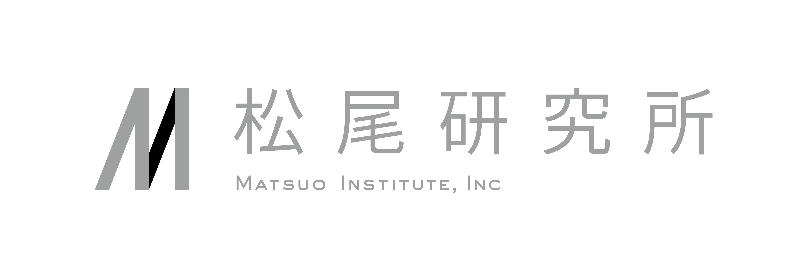

- 2024年2月~2024年7月 エンジニア インターン
- LLMを用いた業務効率化システムの共同研究プロジェクトに参加しました。

**株式会社プレイド**

- 2022年3月~2023年1月 エンジニア インターン
- webプロダクトの開発に参加していました。バックエンド、フロントエンド両方の開発を担当していました。
- キーワード：TypeScript, Express, Vue, Mongo, circleci, e2e, svelte, CDN

**株式会社Alice**
- 2021年7月~2022年1月 エンジニア（業務委託）
- Edge AIの画像認識システムを開発をしました。既存プロダクトの調査、既存技術のサーベイ・検証、論文実装、システム設計、コーディングを一貫して個人プロジェクトとして行いました。
- キーワード：Keras, Tensorflow, ONNX, TensorRT, Jupyter, Git, Docker, Linux

<!-- -------------------------------------------------------- -->
***

## Works

<!-- -------------------------------------------------------- -->

### Presentation in Huawei HeadQuarters
深圳にあるHuaweiの本社で現地のCGチームに自身の研究についてプレゼンテーションを行いました。
（写真取れなかった...）

<!-- -------------------------------------------------------- -->

### SIGGRAPH Asia 2025 Best Communications Award
SIGGRAPH Asia 2025で[SketchRodGS](#sketchrodgs)の発表を行いました。

    

        プレゼンテーションの様子
        
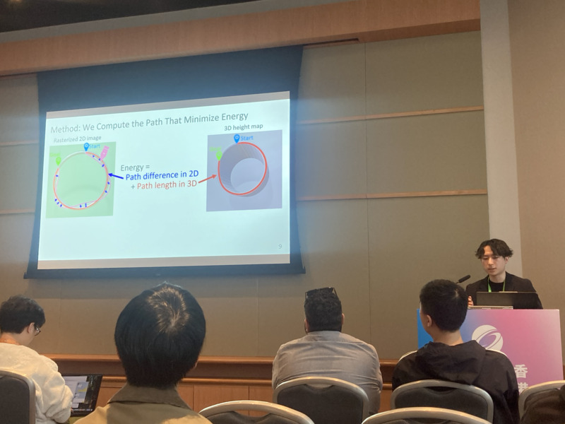

    

    

        賞状&トロフィー
        
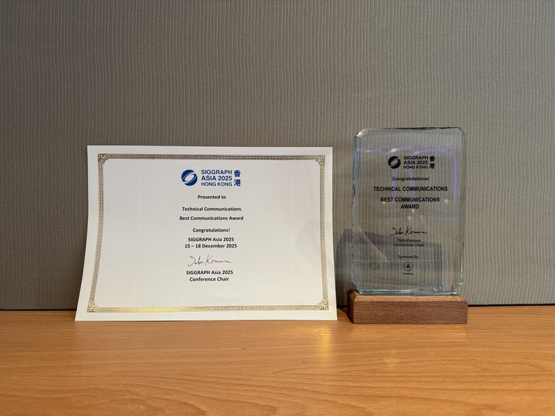

    

    

        Best Communications Award 2
        
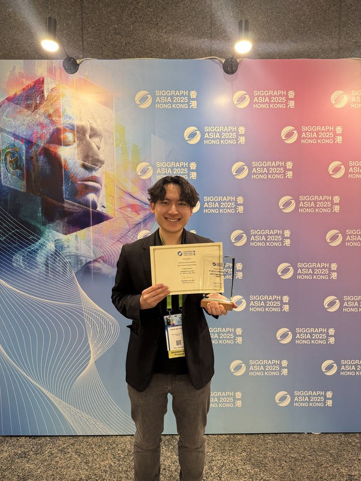

    

    

        Best Communications Award 1
        
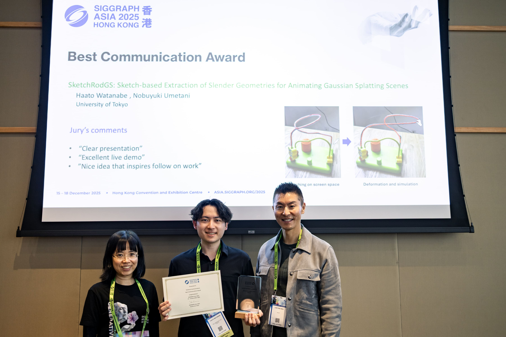

    

<a href="https://asia.siggraph.org/2025/program/award-winners/#:~:text=Best%20Communications%20Awards,Watanabe%2C%20Nobuyuki%20Umetani" target="_blank">Best Communications Award (Best short paper award)</a>を受賞しました。

<!-- -------------------------------------------------------- -->

<!-- ### Presentation in Huawei
Huaweiで本社のCTOに対して自身の研究についてプレゼンテーションを行いました。 -->

<!-- -------------------------------------------------------- -->

### SketchRodGS
**Please click and watch the demo video.** 
[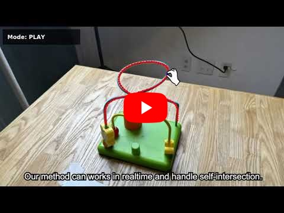](https://youtu.be/eaK0p0nU47g?si=54fC0_AL-OYZkHY3)

- 研究プロジェクト[SketchRodGS](#sketchrodgs)でGaussian splattingシーン中の細長いオブジェクトに対してスケッチからリアルタイムにポリラインを構築しelastic rod simulationを適用できるシステムを開発しました。
- Viewer部分はQt(pyside), レンダリング部分はINRIAのGSレンダリングコード（ちょっと改造した）, コア部分はcppとCUDAで実装しました。シミュレーション部分はDelFEMというライブラリを使用しました。
- [**実装を公開しています。**](https://github.com/haato-w/sketch-rod-gs "github repository"){:target="_blank"}

<!-- -------------------------------------------------------- -->

### Shell reimplementation
勉強のためにでBash likeなshellをc言語で再実装しました。基本ライブラリは[自身で実装したもの](#c-standard-library-reimplementation)を用いました。
以下の機能を再現しました。
- **コマンド実行**: 外部コマンドの実行と PATH 解決
- **ビルトインコマンド**: `echo`, `cd`, `pwd`, `export`, `unset`, `env`, `exit`
- **パイプライン**: コマンド間のデータフロー (`|`)
- **リダイレクション**: 入力/出力のファイルリダイレクト (`<`, `>`, `>>`)
- **ヒアドキュメント**: 複数行入力 (`<<`)
- **環境変数**: 変数の展開と管理 (`$VAR`)
- **クォート処理**: シングル・ダブルクォート内の文字列処理
- **シグナル処理**: `Ctrl+C`, `Ctrl+D`, `Ctrl+\`

コマンドは子プロセスで実行するなどのBash内部の処理だけでなく、機能も改めて学べました。 
[**実装を公開しています。**](url "github repository"){:target="_blank"}

<!-- -------------------------------------------------------- -->

### MIRU 2025 優秀賞 & オーディエンス賞
2025 MIRU（画像の認識・理解シンポジウム）[3D Gabor Splatting](#3d_gabor_splatting)の発表を行いました。

    

        プレゼンテーションの様子
        
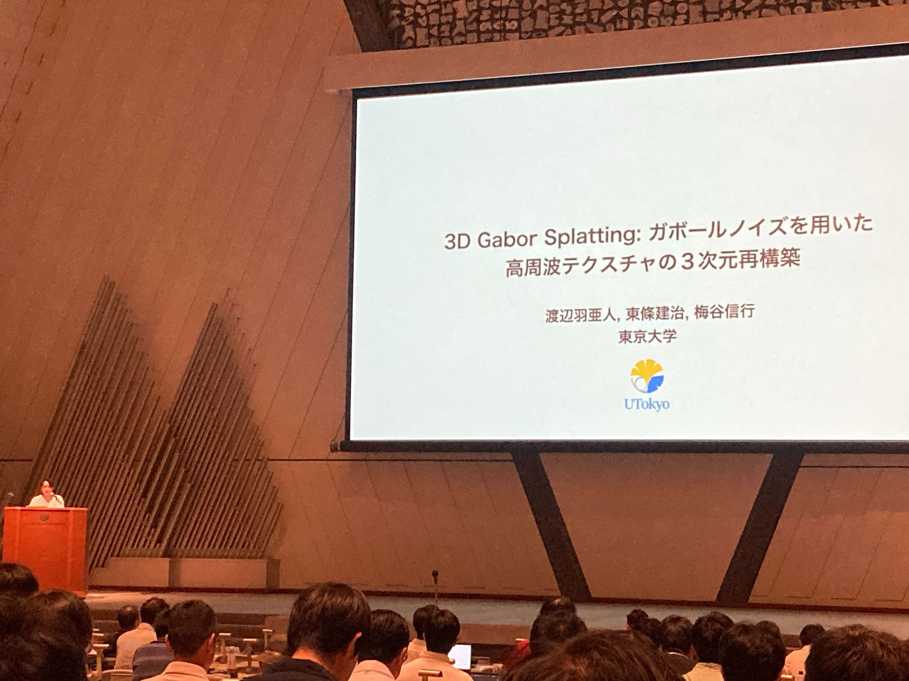

    

    

        優秀賞受賞
        
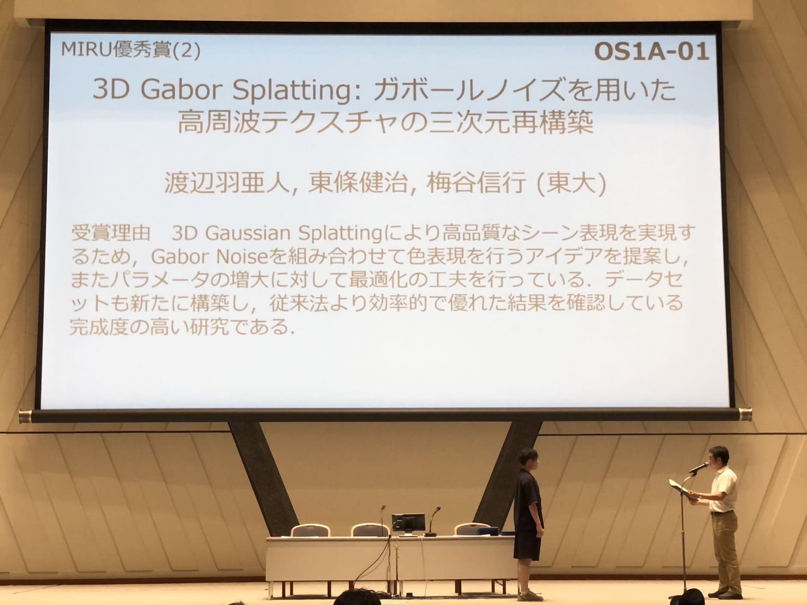

    

    

        オーディエンス賞受賞
        
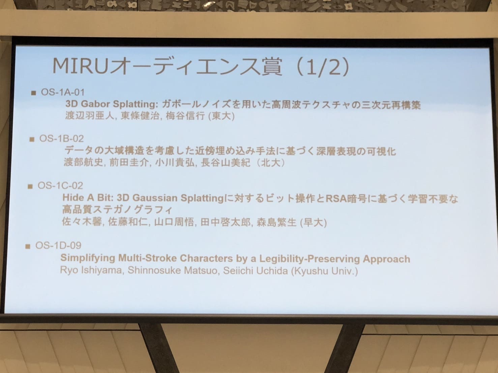

    

    

        賞状
        
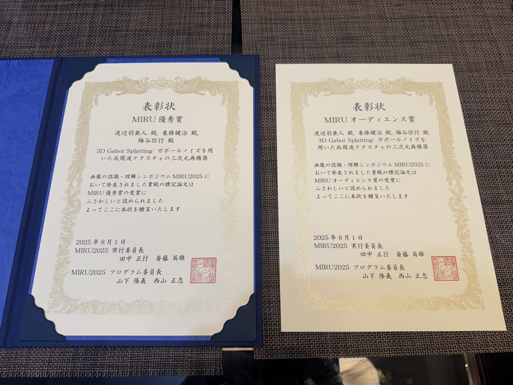

    

<a href="https://cvim.ipsj.or.jp/MIRU2025/award.html#MIRU_Excellent_Paper_Awards:~:text=OS1A%2D01,%E7%A0%94%E7%A9%B6%E3%81%A7%E3%81%82%E3%82%8B%EF%BC%8E" target="_blank">優秀賞（MIRU Excellent Paper Award）</a>と<a href="https://cvim.ipsj.or.jp/MIRU2025/award.html#MIRU_Excellent_Paper_Awards:~:text=MIRU%E3%82%AA%E3%83%BC%E3%83%87%E3%82%A3%E3%82%A8%E3%83%B3%E3%82%B9%E8%B3%9E-,OS1A%2D01,%E5%86%8D%E6%A7%8B%E7%AF%89%0A%E6%B8%A1%E8%BE%BA%E7%BE%BD%E4%BA%9C%E4%BA%BA%2C%20%E6%9D%B1%E6%A2%9D%E5%81%A5%E6%B2%BB%2C%20%E6%A2%85%E8%B0%B7%E4%BF%A1%E8%A1%8C%20(%E6%9D%B1%E5%A4%A7),-OS1B%2D02" target="_blank">オーディエンス賞（MIRU Audience Award）</a>を受賞しました。

<!-- -------------------------------------------------------- -->

### NeRF in 2D Space

  

    学習の様子 
    <video src="https://github.com/user-attachments/assets/662f8d41-5ada-41bc-8c46-02aead7214c8" controls="true" loop="true" autoplay="true" muted width="256"></video>
  

<!-- https://github.com/user-attachments/assets/662f8d41-5ada-41bc-8c46-02aead7214c8 -->

NeRFの学習を画像空間のみで行うコードです。3次元再構築ではないので実用性は無いですが、NeRFのpositional encodingがどれほどのものかを自分で確かめてみたくなり実装しました。想像以上にpositional encodingが有る場合と無い場合で差が出たので面白かったです。因みにpositional encodingをx軸、y軸のどちらかに絞ると高周波成分を表現したい方向を制限することもできました。つまり、縦方向(横方向)だけ綺麗に学習して直角方向はぼやかすことができます。

    

         
        Ground Truth画像
        

         
    

    

        Positional Encoding無し 
        (10,000 iterations)
        
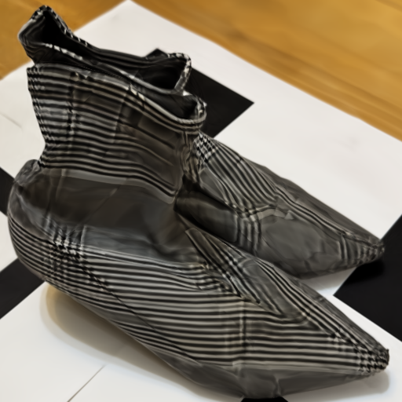

        高周波成分を表現できていません。
    

    

        Positional Encodingあり 
        (3,000 iterations)
        

        高周波成分を表現できています。
    

<!-- -------------------------------------------------------- -->

### Fractal visualizer

<video src="https://github.com/user-attachments/assets/473ecf52-27a5-4653-b347-ff8ec83f1de2" controls="true" loop="true" autoplay="true" muted width="600"></video>
<!-- https://github.com/user-attachments/assets/473ecf52-27a5-4653-b347-ff8ec83f1de2 -->
<video src="https://github.com/user-attachments/assets/32deed89-46c9-4d9b-87b2-d29ce2d52388" controls="true" loop="true" autoplay="true" muted width="600"></video>
<!-- https://github.com/user-attachments/assets/32deed89-46c9-4d9b-87b2-d29ce2d52388 -->

急にやってみたくなったので、Julia集合とMadelbrot集合をレンダリングするコードを書いてみました。

<!-- -------------------------------------------------------- -->

### Making Visual hull mesh from mask images and camera params

<video src="https://github.com/user-attachments/assets/37b00ca7-bea7-425f-9018-5901d05bca99" controls="true" loop="true" autoplay="true" muted width="600"></video>
<!-- https://github.com/user-attachments/assets/37b00ca7-bea7-425f-9018-5901d05bca99 -->
<!-- https://github.com/user-attachments/assets/c5bd42dd-4f6a-47c8-a2f9-fd9c84778653 -->

- 多視点画像データのカメラパラメータとマスク画像から対象物体のvisual hull meshを生成するコードを実装しました。
- visual hullを作成するコードは存在していたのですが、使いにくかったのでシンプルな仕様で作り直しました。
- [**実装を公開しています。**](https://github.com/haato-w/visual-hull-mesh-creator/tree/main "github repository"){:target="_blank"}

<!-- -------------------------------------------------------- -->

### Nerf synthetic data creation code using Mitsuba renderer

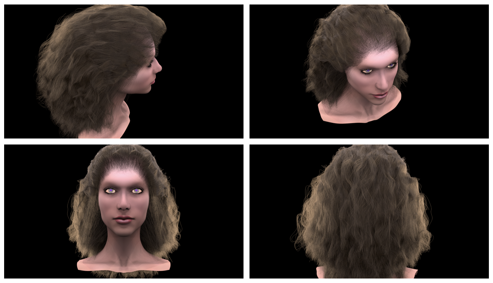

- Mitsuba rendererを使用してNeRFのsyntheticデータを撮影する環境を作成しました。
- 公式実装ではBlender上のスクリプトで作成されていますが、Mitsuba rendererでデータを撮りたくなったので作成しました。
- 写真は[Yuksel hair dataset](http://www.cemyuksel.com/research/hairmodels/ "cem yuksel"){:target="_blank"}(curly)をレンダリングした例です。
- Mitsuba上でオブジェクトを配置してランダムな位置から撮影できます。
- ランダムに位置を決める処理や出力されるカメラパラメータファイルはNerf-syntheticデータセットを作成するコードに合わせて作っているので、3D Reconstructionに使いやすいと思います。
- コードに書かれている[dict(json)データを設定することでレンダリングするシーンを変更](https://mitsuba.readthedocs.io/en/stable/src/generated/plugins_shapes.html "mitsuba document"){:target="_blank"}できます。
- [**実装を公開しています。**](https://github.com/haato-w/nerf-synthetic-data-creator-using-mitsuba "github repository"){:target="_blank"}

<!-- -------------------------------------------------------- -->

### Stable fluids implementation

<video src="https://github.com/user-attachments/assets/a12588de-e853-421a-a99f-04d1af530765" controls="true" loop="true" autoplay="true" muted width="300"></video>
<!-- https://github.com/user-attachments/assets/a12588de-e853-421a-a99f-04d1af530765 -->

- 流体シミュレーションの1種であるStable fluidsをC++で実装しました。OpenMPを用いてSIMD並列化とスレッド並列化を行いました。
- Poisson方程式はJacobi法で計算しています。
- 元々流体シミューレーションに興味があったのでキャッチアップの最初のステップとして丁度良いと思い始めました。
- 書籍「GPU Gems」の38章「GPU上での高速な流体力学シミュレーション」が分かりやすかったです。

<!-- -------------------------------------------------------- -->

### 3D Gabor Splatting

<video src="https://github.com/user-attachments/assets/843e8ec3-775b-4f0b-9f1a-44526e8cca3b" controls="true" loop="true" autoplay="true" muted width="512"></video>
<!-- https://github.com/user-attachments/assets/843e8ec3-775b-4f0b-9f1a-44526e8cca3b -->

- 研究プロジェクト[3D Gabor Splatting](#3d_gabor_splatting)で2D Gaussian splattingのコードをベースとし、拡張したGabor kernelをfittingするシステムを開発しました。
- コア部分はCUDA differentiable rasterizerを改造しました。
- [**実装を公開しています。**](https://github.com/haato-w/3d-gabor-splatting "github repository"){:target="_blank"}
<!-- - [**データセットを公開しています。**](https://github.com/haato-w/3d-gabor-splatting "github repository"){:target="_blank"} -->

<!-- -------------------------------------------------------- -->

### Gabor noise rasterizer in image space using pytorch

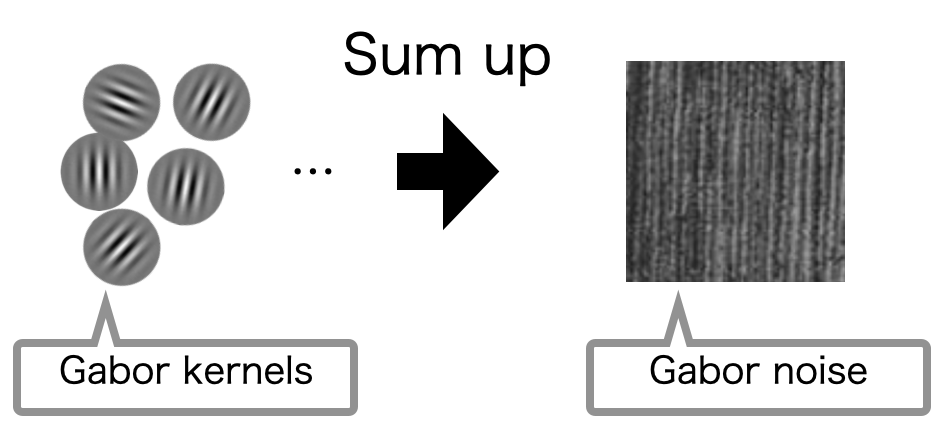&nbsp;&nbsp;&nbsp;&nbsp;&nbsp;
<video src="https://github.com/user-attachments/assets/4e99b9c3-1890-4923-9db4-4c855d93b0ab" controls="true" loop="true" autoplay="true" muted width="400"></video>

<!-- https://github.com/user-attachments/assets/4e99b9c3-1890-4923-9db4-4c855d93b0ab -->
<!-- https://github.com/user-attachments/assets/0eeefd1f-b22f-45c2-ab16-bc9c953ce50c -->

- PytorchでGabor noiseを表示するコードを作成しました。Pytorchで実装しているためexample imageに対してfittingをすることができます。
- Gabor noiseとは
    - Gaussian distributionに正弦波を掛けたものをGabor kernelと言います。
    - Gabor kernelは画像から特徴を検出する場合に使われますが、複数のGabor kernelを画像空間で足し合わせることで様々なテクスチャを表現することができ、そのようなテクスチャをGabor noiseと言います。
    - Gabor noiseはProcedural Texture Generation技術の1種として有名なものになります。
- [**実装を公開しています。**](https://github.com/haato-w/gabor-noise-fitting-with-pytorch "github repository"){:target="_blank"}

<!-- -------------------------------------------------------- -->

### 4D Gaussian Splatting Web Viewer

<!-- <iframe width="560" height="315" src="https://www.youtube.com/embed/dPzrhA_5MDw?si=KoVLpvjnd7yvuY5a" title="YouTube video player" frameborder="0" allow="accelerometer; autoplay; clipboard-write; encrypted-media; gyroscope; picture-in-picture; web-share" referrerpolicy="strict-origin-when-cross-origin" allowfullscreen></iframe> -->
<iframe width="450" height="300" src="https://www.youtube.com/embed/uEdum66-xPc?si=eAeCWp-txWZRwIPq" title="YouTube video player" frameborder="0" allow="accelerometer; autoplay; clipboard-write; encrypted-media; gyroscope; picture-in-picture; web-share" referrerpolicy="strict-origin-when-cross-origin" allowfullscreen></iframe>
<!-- https://www.youtube.com/embed/<video_id>?autoplay=1&mute=1&playsinline=1&loop=1&playlist=<video_id> -->

- [プリファード・ネットワークスのR&Dサマーインターン、アルバイト](#pfn_intern)で動きのある3D Sceneを再構成する手法である4D Gaussian SplattingのWeb Viewerを開発しました。PCとモバイルデバイスの両方で動作します。
- WebGLとReactで開発を行いました。シェーダーでのレンダリング処理やカメラ操作、視点変更UIのための衝突判定処理等を実装しました。
- ウェブブラウザという限られた環境の中で様々な処理を行う必要があるため、処理の効率化やスレッド並列化を特に工夫しました。
- サマーインターンにおける開発成果は[**テックブログ**](https://tech.preferred.jp/ja/blog/4d-gaussian-splatting-web-viewer/ "PFN Tech Blog"){:target="_blank"}として公開しています。
- 時間周りは書籍「ゲームエンジン・アーキテクチャ」の7.4, 7.5章の時間の扱いが参考になりました。

<!-- -------------------------------------------------------- -->

### C Standard Library reimplementation
- 低レイヤのコードに慣れようと思い、C標準ライブラリを再実装しました。
- 実装難易度は全く高くないですが、自分で書くと細かい仕様を学べるので楽しかったです。
- [**実装を公開しています。**](https://github.com/haato-w/my-c-standard-library "github repository"){:target="_blank"}

<!-- -------------------------------------------------------- -->

### 視線によるキーボード入力アプリ

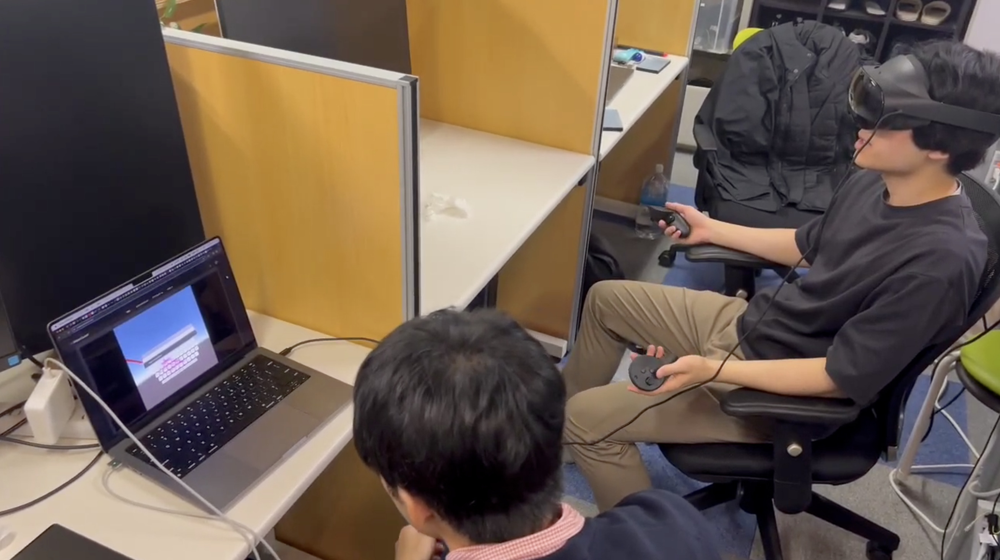
<video src="https://github.com/user-attachments/assets/b8325822-dc42-422c-8833-4242fbcbc9ca" controls="true" loop="true" autoplay="true" muted width="400"></video>

<!-- https://github.com/user-attachments/assets/b8325822-dc42-422c-8833-4242fbcbc9ca -->

- Meta Quest上でどうさする視線で英字キーボードを操作できるシステムです。
- 視線でキーボードをなぞり、ジェスチャータイピングを行うことで英単語を入力できます。
- 動画は与えられたテキストを視線で入力している様子です。
- マウス操作は目で行い、選択はコントローラで行います。
- [**実装を公開しています。**](https://github.com/haato-w/VRKeyBoardUsingGestureTypingWithEyeTracking "github repository"){:target="_blank"}

<!-- -------------------------------------------------------- -->

### ペリペリ感触アプリ

<video src="https://github.com/user-attachments/assets/f83fb95f-f8f6-4a55-b9c2-7871669fbf96" controls="true" loop="true" autoplay="true" muted width="400"></video>
<!-- https://github.com/user-attachments/assets/f83fb95f-f8f6-4a55-b9c2-7871669fbf96 -->

- iOS上で動作する「くじ引きをめくっているときのペリペリ感を体感する」ことができるアプリを開発しました。スマホの画面を指でなぞるとくじがめくられるアニメーションが動作し、バイブレーションによりくじをめくっている感触を体験できます。
- ハイカジュゲームを作る過程で実験のために作りました。
- 動画はめくっている様子を示しています。めくる動作と同時にバイブレーションでぺりぺり感を演出します。
- アニメーションはUnity、バイブレーションはCore Hapticsを用いて開発しました。
- Test Flightで配布してテストしていました。

<!-- -------------------------------------------------------- -->

### Ray-tracing implementation

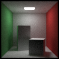

- 趣味でRay-tracingをC++で実装しました。
- 画像はコーネルボックスを100x100pxでレンダリングした結果です。

<!-- -------------------------------------------------------- -->

### ナンバープレート認識システム

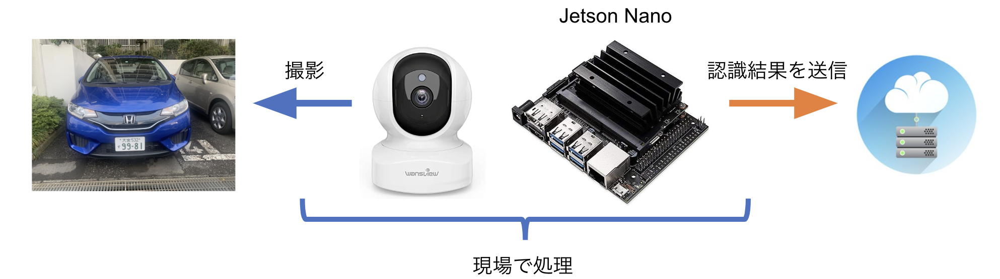

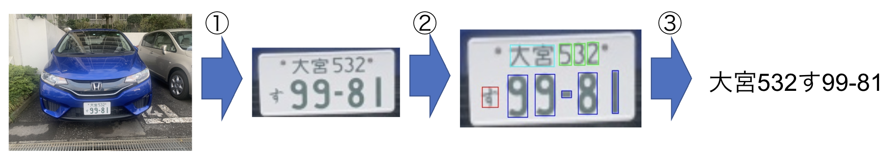

- Edge AIコンピュータのJetson Nano上で動作する日本語ナンバープレート認識システムを開発しました。
- 研究開発案件で開発しました。
- 開発当時、Nvidiaが公開しているLPRモデルが日本のナンバープレートに対応していなかったため、日本のナンバープレートに対応するシステムを開発しました。
- 以下、開発内容の一部です。
    - NvidiaのLPDNetモデルをTensorRTライブラリで高速化
    - OpenCVを用いた画像処理による文字の抽出
    - 文字認識CNNモデルを訓練しTensorRTライブラリで高速化
- プロジェクトの過程で作成した**コードを公開しています**。
    - [**tensorrt-infer-python**](https://github.com/haato-w/tensorrt-infer-python "github repository"){:target="_blank"}
        - PythonでTensorRTを用いてinferenceをするコードです。
    - [**google-drive-document-ocr**](https://github.com/haato-w/google-drive-document-ocr "github repository"){:target="_blank"}
        - Google DocumentのOCR機能を用いてOCRを行うコードです。
        - GoogleDriveAPIを利用します。
        - Google DocumentのOCR機能の精度が良かったので遊びで作りました。
    - [**deepstream_lpr_app_python**](https://github.com/haato-w/deepstream_lpr_app_python "github repository"){:target="_blank"}
        - [Nvidiaが公開しているLicense Place Recognition(LPR)モデル](https://catalog.ngc.nvidia.com/orgs/nvidia/teams/tao/models/lprnet "nvidia ngc catalog"){:target="_blank"}のPython版です。
        - [公式のサンプルコード](https://github.com/NVIDIA-AI-IOT/deepstream_lpr_app "github repository"){:target="_blank"}はCで書かれていたのでPythonで作りました。

<!-- -------------------------------------------------------- -->

### ImageDataAugmentation code

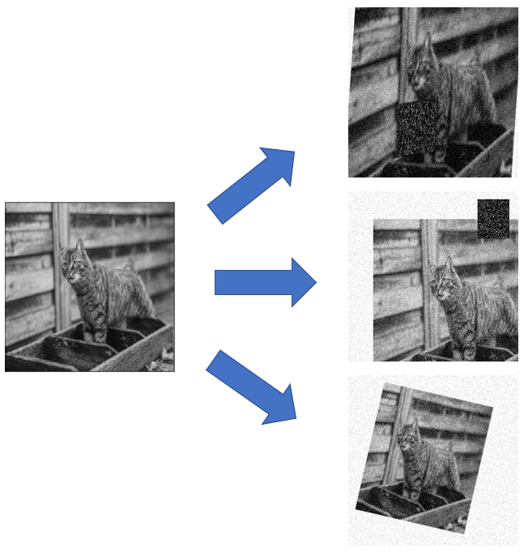

- 細かい調整ができるデータアーギュメンテーションのコードです。
- [ナンバープレート認識システム](#license_plate_system)の開発の過程で文字認識を行う必要があり、当時細かいパラメータ調整ができるライブラリが無かったので作りました。
- [**実装を公開しています。**](https://github.com/haato-w/ImageDataAugmentation?tab=readme-ov-file "github repository"){:target="_blank"}

<!-- -------------------------------------------------------- -->

### サイクリスト用情報交換サイト(DeNAハッカソン)

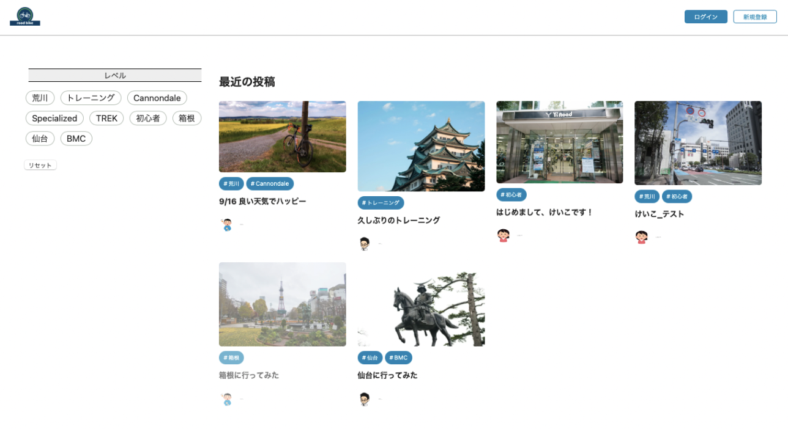

- 5人の学生チームでサイクリスト用情報交換サイトを作成しました。
- DeNAのオータムハッカソン 2022で作成しました。
- 自身はバックエンドを担当しました。
- フロントエンドはReact、バックエンドはdjango, SQLiteで開発し、EC2にデプロイしました。

<!-- -------------------------------------------------------- -->

### 姿勢監視タスク管理アプリ
- タスク管理用タイマーに作業時の姿勢を監視して姿勢が崩れると警告を発する機能を付けたデスクトップアプリを開発しました。
- ハッカソンで作成しました。
- 姿勢推定はOpenPoseを用いており、フロントエンドはTkinterで作成しました。

<!-- -------------------------------------------------------- -->

### Learning App on Android

<video src="https://github.com/user-attachments/assets/01983eb8-0422-4cea-8e37-6e9c6aef532e" controls="true" loop="true" autoplay="true" muted width="400"></video>
<!-- https://github.com/user-attachments/assets/01983eb8-0422-4cea-8e37-6e9c6aef532e -->

- １問１答形式の問題を練習するためのAndroidアプリケーションです。
- サーバー側に問題と答えのCSVファイルを入れておくことで様々な問題を配布することができます。
- フロントエンドはJava、バックエンドはPHPで作りました。
- 塾講師の友人がアプリを欲しがっていたので作りました。
- [**実装を公開しています。**](https://github.com/haato-w/android-learning-app-java.git "github repository"){:target="_blank"}

<!-- -------------------------------------------------------- -->
<!-- -------------------------------------------------------- -->
***

## Awards
- SIGGRAPH Asia 2025
    - <a href="https://asia.siggraph.org/2025/program/award-winners/#:~:text=Best%20Communications%20Awards,Watanabe%2C%20Nobuyuki%20Umetani" target="_blank">Best Communications Award (Best short paper award)</a>を受賞しました。

- 2025 MIRU（画像の認識・理解シンポジウム）
    - <a href="https://cvim.ipsj.or.jp/MIRU2025/award.html#MIRU_Excellent_Paper_Awards:~:text=OS1A%2D01,%E7%A0%94%E7%A9%B6%E3%81%A7%E3%81%82%E3%82%8B%EF%BC%8E" target="_blank">優秀賞（MIRU Excellent Paper Award）</a>と<a href="https://cvim.ipsj.or.jp/MIRU2025/award.html#MIRU_Excellent_Paper_Awards:~:text=MIRU%E3%82%AA%E3%83%BC%E3%83%87%E3%82%A3%E3%82%A8%E3%83%B3%E3%82%B9%E8%B3%9E-,OS1A%2D01,%E5%86%8D%E6%A7%8B%E7%AF%89%0A%E6%B8%A1%E8%BE%BA%E7%BE%BD%E4%BA%9C%E4%BA%BA%2C%20%E6%9D%B1%E6%A2%9D%E5%81%A5%E6%B2%BB%2C%20%E6%A2%85%E8%B0%B7%E4%BF%A1%E8%A1%8C%20(%E6%9D%B1%E5%A4%A7),-OS1B%2D02" target="_blank">オーディエンス賞（MIRU Audience Award）</a>を受賞しました。
- 2022 DeNA オータムハッカソン 優勝
    - 自身がリーダーを努めたチームで[サイクリスト用情報交換サイト](#dena_autum_hackathon)を作成しました。

<!-- -------------------------------------------------------- -->
<!-- -------------------------------------------------------- -->
***

## Misc.
- TOEFL iBT: 79 (2022 September)
- TOEIC L&R: 920 (2023 February)
- 応用情報技術者試験
- 42 Tokyoに所属しており、低レイヤ側の開発の練習をしています。
