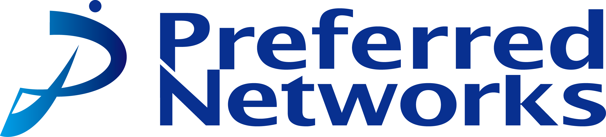

# Haato Watanabe（渡辺 羽亜人）

## About
所属：東京大学大学院 情報理工学系研究科 創造情報学専攻 梅谷研究室 修士　 
専門：コンピュータ・グラフィックス、特にコンテンツ制作支援とシミュレーションに興味があり、現在は3D Reconstructionの研究をしています。

- [Github](https://github.com/haato-w "Haato Watanabe Github home")
- [Wantedly](https://www.wantedly.com/id/haato_watanabe "Haato Watanabe Wantedly home")

<!-- -------------------------------------------------------- -->
***

## Publications
<!-- <dl>
  <dt>Comming Soon.</dt>
</dl> -->

<!-- <dl>
  <dt>Comming Soon.</dt>
</dl> -->

**Comming Soon.**

**Exploring User’s Line of Sight And Word Gesture Text Entry Techniques in Virtual Reality**
- Haato Watanabe, Ryo Hatano, Hiroyuki Nishiyama 
- Proceedings of the Joint Symposium of The Twenty-Ninth International Symposium on Artificial Life and Robotics (AROB 29th 2024) 
- VR空間において、目線で英字キーボード入力を行うシステムの提案、評価を行いました。

<!-- -------------------------------------------------------- -->
***

## Experience
**株式会社Preferred Networks**

- R&Dサマーインターン、パートタイムエンジニア
- 4D Gaussian splatting web viewerの開発をしました。<a href="https://tech.preferred.jp/ja/blog/4d-gaussian-splatting-web-viewer/" target="_blank">成果ブログ</a>を公開しています。

**株式会社松尾研究所**

- エンジニア インターン
- LLMを用いた業務効率化システムの共同研究プロジェクトに参加しました。

**株式会社プレイド**

- エンジニア インターン
- webプロダクトの開発に参加していました。バックエンド、フロントエンド両方の開発を担当していました。
- キーワード：TypeScript, Express, Vue, Mongo, circleci, e2e, svelte, CDN

**株式会社Alice**
- エンジニア（業務委託）
- Edge AIの画像認識システムを開発をしました。既存プロダクトの調査、既存技術のサーベイ・検証、論文実装、システム設計、コーディングを一貫して個人プロジェクトとして行いました。
- キーワード：Keras, Tensorflow, ONNX, TensorRT, Jupyter, Git, Docker, Linux

<!-- -------------------------------------------------------- -->
***

## Works

### Making Visual hull mesh from mask images and camera params

<video src="https://github.com/user-attachments/assets/37b00ca7-bea7-425f-9018-5901d05bca99" controls="true" loop="true" autoplay="true" muted width="600"></video>
<!-- https://github.com/user-attachments/assets/37b00ca7-bea7-425f-9018-5901d05bca99 -->
<!-- https://github.com/user-attachments/assets/c5bd42dd-4f6a-47c8-a2f9-fd9c84778653 -->

- 多視点画像データのカメラパラメータとマスク画像から対象物体のvisual hull meshを生成するコードを実装しました。
- visual hullを作成するコードは存在していたのですが、使いにくかったのでシンプルな仕様で作り直しました。
- 実装を公開しています。

### Nerf synthetic data creation code using Mitsuba renderer

- Mitsuba rendererを使用してNeRFのsyntheticデータを撮影する環境を作成しました。
- 公式実装ではBlender上のスクリプトで作成されていますが、Mitsuba rendererでデータを撮りたくなったので作成しました。
- 写真は[Yuksel hair dataset](http://www.cemyuksel.com/research/hairmodels/ "cem yuksel"){:target="_blank"}(curly)をレンダリングした例です。
- Mitsuba上でオブジェクトを配置してランダムな位置から撮影できます。
- ランダムに位置を決める処理や出力されるカメラパラメータファイルはNerf-syntheticデータセットを作成するコードに合わせて作っているので、3D Reconstructionに使いやすいと思います。
- コードに書かれている[jsonデータを設定することでレンダリングするシーンを変更](https://mitsuba.readthedocs.io/en/stable/src/generated/plugins_shapes.html "mitsuba document"){:target="_blank"}できます。
- 実装を公開しています。

### Stable fluids implementation

<video src="https://github.com/user-attachments/assets/a12588de-e853-421a-a99f-04d1af530765" controls="true" loop="true" autoplay="true" muted width="300"></video>
<!-- https://github.com/user-attachments/assets/a12588de-e853-421a-a99f-04d1af530765 -->

- 流体シミュレーションの1種であるStable fluidsをCで実装しました。OpenMPを用いてSIMD並列化とスレッド並列化を行いました。
- Poisson方程式はJacobi法で計算しています。
- 元々流体シミューレーションに興味があったのでキャッチアップの最初のステップとして丁度良いと思い始めました。
- 書籍「GPU Gems」の38章「GPU上での高速な流体力学シミュレーション」が分かりやすかったです。

<!-- **3D Gabor Splatting** -->

### Gabor noise rasterizer in image space using pytorch

&nbsp;&nbsp;&nbsp;&nbsp;&nbsp;
<video src="https://github.com/user-attachments/assets/4e99b9c3-1890-4923-9db4-4c855d93b0ab" controls="true" loop="true" autoplay="true" muted width="400"></video>

<!-- https://github.com/user-attachments/assets/4e99b9c3-1890-4923-9db4-4c855d93b0ab -->
<!-- https://github.com/user-attachments/assets/0eeefd1f-b22f-45c2-ab16-bc9c953ce50c -->

- 画像空間でGabor noiseを生成できるコードです。
- pytorchで実装しているためexample imageに対してfittingをすることができます。
- 実装を公開しています。

### 4D Gaussian Splatting Web Viewer

<!-- <iframe width="560" height="315" src="https://www.youtube.com/embed/dPzrhA_5MDw?si=KoVLpvjnd7yvuY5a" title="YouTube video player" frameborder="0" allow="accelerometer; autoplay; clipboard-write; encrypted-media; gyroscope; picture-in-picture; web-share" referrerpolicy="strict-origin-when-cross-origin" allowfullscreen></iframe> -->
<iframe width="450" height="300" src="https://www.youtube.com/embed/uEdum66-xPc?si=eAeCWp-txWZRwIPq" title="YouTube video player" frameborder="0" allow="accelerometer; autoplay; clipboard-write; encrypted-media; gyroscope; picture-in-picture; web-share" referrerpolicy="strict-origin-when-cross-origin" allowfullscreen></iframe>
<!-- https://www.youtube.com/embed/<video_id>?autoplay=1&mute=1&playsinline=1&loop=1&playlist=<video_id> -->

- [プリファード・ネットワークスのR&Dサマーインターン、アルバイト](#pfn_intern)で動きのある3D Sceneを再構成する手法である4D Gaussian SplattingのWeb Viewerを開発しました。PCとモバイルデバイスの両方で動作します。
- WebGLとReactで開発を行いました。シェーダーでのレンダリング処理やカメラ操作、視点変更UIのための衝突判定処理等を実装しました。
- ウェブブラウザという限られた環境の中で様々な処理を行う必要があるため、処理の効率化やスレッド並列化を特に工夫しました。
- サマーインターンにおける開発成果は[**テックブログ**](https://tech.preferred.jp/ja/blog/4d-gaussian-splatting-web-viewer/ "PFN Tech Blog"){:target="_blank"}として公開しています。
- 時間周りは書籍「ゲームエンジン・アーキテクチャ」の7.4, 7.5章の時間の扱いが参考になりました。

### C Standard Library reimplementation
- 低レイヤのコードに慣れようと思い、C標準ライブラリを再実装しました。
- 実装難易度は全く高くないですが、自分で書くと細かい仕様を学べるので楽しかったです。
- [**実装を公開しています。**](https://github.com/haato-w/my-c-standard-library "github repository"){:target="_blank"}

### 視線によるキーボード入力アプリ

<video src="https://github.com/user-attachments/assets/b8325822-dc42-422c-8833-4242fbcbc9ca" controls="true" loop="true" autoplay="true" muted width="400"></video>

<!-- https://github.com/user-attachments/assets/b8325822-dc42-422c-8833-4242fbcbc9ca -->

- Meta Quest上でどうさする視線で英字キーボードを操作できるシステムです。
- 視線でキーボードをなぞり、ジェスチャータイピングを行うことで英単語を入力できます。
- 動画は与えられたテキストを視線で入力している様子です。
- マウス操作は目で行い、選択はコントローラで行います。
- [**実装を公開しています。**](https://github.com/haato-w/VRKeyBoardUsingGestureTypingWithEyeTracking "github repository"){:target="_blank"}

### ペリペリ感触アプリ

<video src="https://github.com/user-attachments/assets/f83fb95f-f8f6-4a55-b9c2-7871669fbf96" controls="true" loop="true" autoplay="true" muted width="400"></video>
<!-- https://github.com/user-attachments/assets/f83fb95f-f8f6-4a55-b9c2-7871669fbf96 -->

- iOS上で動作する「くじ引きをめくっているときのペリペリ感を体感する」ことができるアプリを開発しました。スマホの画面を指でなぞるとくじがめくられるアニメーションが動作し、バイブレーションによりくじをめくっている感触を体験できます。
- ハイカジュゲームを作る過程で実験のために作りました。
- 動画はめくっている様子を示しています。めくる動作と同時にバイブレーションでぺりぺり感を演出します。
- アニメーションはUnity、バイブレーションはCore Hapticsを用いて開発しました。
- Test Flightで配布してテストしていました。

### Ray-tracing implementation

- 趣味でRay-tracingをC++で実装しました。
- 画像はコーネルボックスの100x100pxでレンダリングした結果です。

### ナンバープレート認識システム

- Edge AIコンピュータのJetson Nano上で動作する日本語ナンバープレート認識システムを開発しました。
- 研究開発案件で開発しました。
- 開発当時、Nvidiaが公開しているLPRモデルが日本のナンバープレートに対応していなかったため、日本のナンバープレートに対応するシステムを開発しました。
- 以下、開発内容の一部です。
    - NvidiaのLPDNetモデルをTensorRTライブラリで高速化
    - OpenCVを用いた画像処理による文字の抽出
    - 文字認識CNNモデルを訓練しTensorRTライブラリで高速化
- プロジェクトの過程で作成した**コードを公開しています**。
    - [**tensorrt-infer-python**](https://github.com/haato-w/tensorrt-infer-python "github repository"){:target="_blank"}
        - PythonでTensorRTを用いてinferenceをするコードです。
    - [**google-drive-document-ocr**](https://github.com/haato-w/google-drive-document-ocr "github repository"){:target="_blank"}
        - Google DocumentのOCR機能を用いてOCRを行うコードです。
        - GoogleDriveAPIを利用します。
        - Google DocumentのOCR機能の精度が良かったので遊びで作りました。
    - [**deepstream_lpr_app_python**](https://github.com/haato-w/deepstream_lpr_app_python "github repository"){:target="_blank"}
        - [Nvidiaが公開しているLicense Place Recognition(LPR)モデル](https://catalog.ngc.nvidia.com/orgs/nvidia/teams/tao/models/lprnet "nvidia ngc catalog"){:target="_blank"}のPython版です。
        - [公式のサンプルコード](https://github.com/NVIDIA-AI-IOT/deepstream_lpr_app "github repository"){:target="_blank"}はCで書かれていたのでPythonで作りました。

### ImageDataAugmentation code

- 細かい調整ができるデータアーギュメンテーションのコードです。
- [ナンバープレート認識システム](#license_plate_system)の開発の過程で文字認識を行う必要があり、当時細かいパラメータ調整ができるライブラリが無かったので作りました。
- [**実装を公開しています。**](https://github.com/haato-w/ImageDataAugmentation?tab=readme-ov-file "github repository"){:target="_blank"}

### サイクリスト用情報交換サイト(DeNAハッカソン)

- 5人の学生チームでサイクリスト用情報交換サイトを作成しました。
- DeNAのオータムハッカソン 2022で作成しました。
- 自身はバックエンドを担当しました。
- フロントエンドはReact、バックエンドはdjango, SQLiteで開発し、EC2にデプロイしました。

### 姿勢監視タスク管理アプリ
- タスク管理用タイマーに作業時の姿勢を監視して姿勢が崩れると警告を発する機能を付けたデスクトップアプリを開発しました。
- ハッカソンで作成しました。
- 姿勢推定はOpenPoseを用いており、フロントエンドはTkinterで作成しました。

### Learning App on Android

<video src="https://github.com/user-attachments/assets/01983eb8-0422-4cea-8e37-6e9c6aef532e" controls="true" loop="true" autoplay="true" muted width="400"></video>
<!-- https://github.com/user-attachments/assets/01983eb8-0422-4cea-8e37-6e9c6aef532e -->

- １問１答形式の問題を練習するためのAndroidアプリケーションです。
- サーバー側に問題と答えのCSVファイルを入れておくことで様々な問題を配布することができます。
- フロントエンドはJava、バックエンドはPHPで作りました。
- 塾講師の友人がアプリを欲しがっていたので作りました。
- [**実装を公開しています。**](https://github.com/haato-w/android-learning-app-java.git "github repository"){:target="_blank"}

<!-- -------------------------------------------------------- -->
***

## Awards
- 2022 DeNA オータムハッカソン 優勝
    - 自身がリーダーを努めたチームで[サイクリスト用情報交換サイト](#dena_autum_hackathon)を作成しました。

<!-- -------------------------------------------------------- -->
***

## Misc.
- TOEFL iBT: 79 (2022 September)
- TOEIC L&R: 920 (2023 February)
- 応用情報技術者試験
- 42 Tokyoに所属しており、低レイヤ側の開発の練習をしています。
